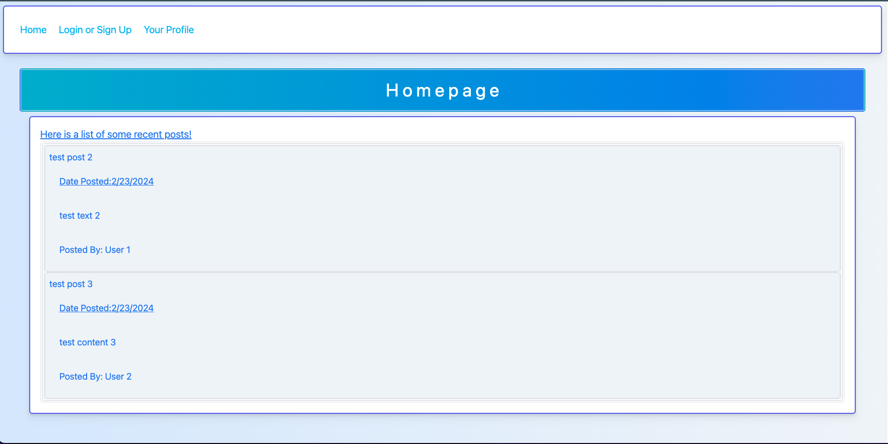
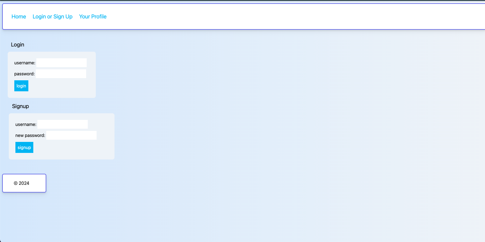
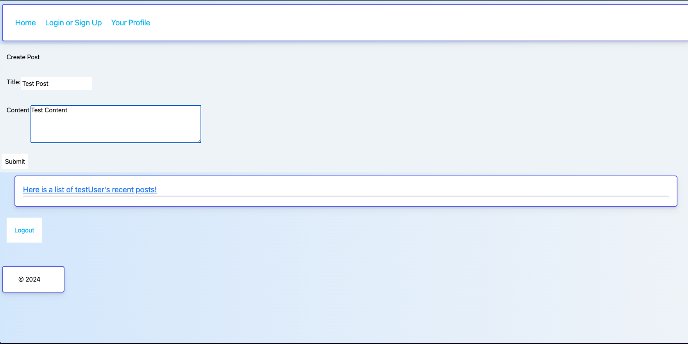
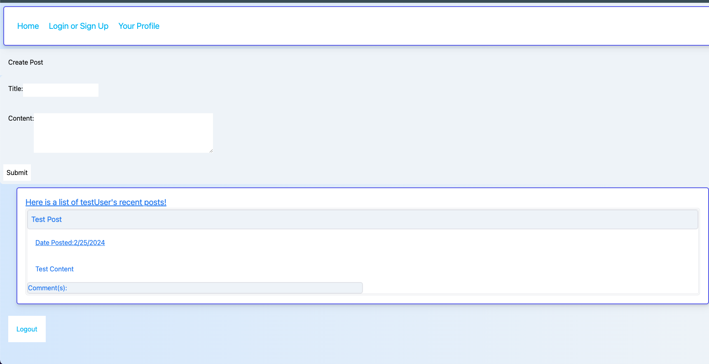
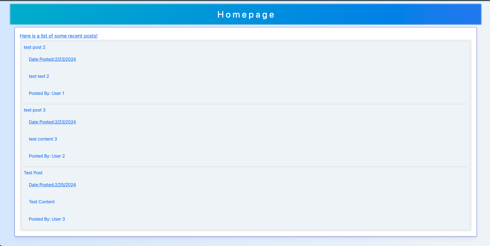
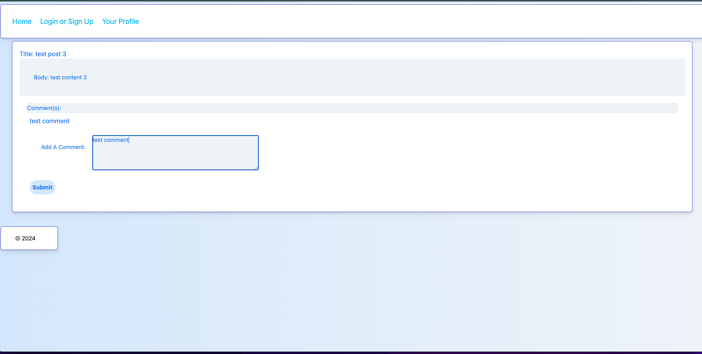
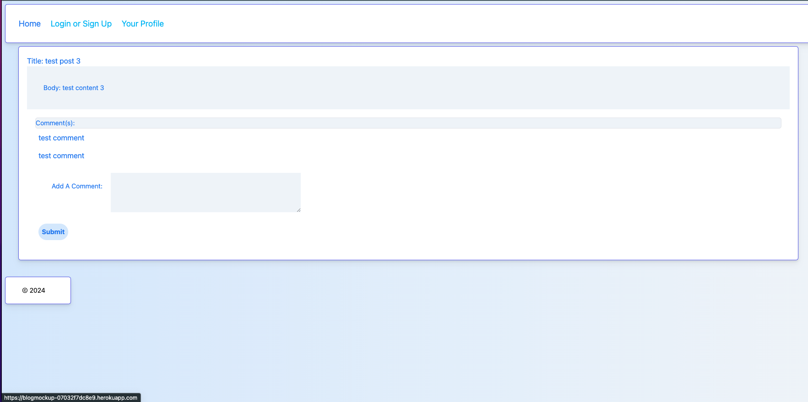

# Blog Mock Up

## Description

This is a basic blog site where users can create accounts, post, and comment on one anothers' posts. It was developed using MVC, JS, and Handlebars as a class exercise for the edX coding bootcamp through the University of Oregon in February 2024.

## Usage 

Users must create an account and be logged in to post and comment. Links are provided at the top of the page to do so. 

## Credits

Edits to routing and models were achieved with the assistance of EdX bootcamp tutor Rene Trevino on Feb 14 and 21 of 2024.
EdX Bootcamp TA Alexander Yu assisted in debugging JavaScript for creating new posts. 

## Badges

Badges aren't necessary, but they demonstrate street cred. Badges let other developers know that you know what you're doing. Check out the badges hosted by [shields.io](://shielhttpsds.io/). You may not understand what they all represent now, but you will in time.

## License

MIT License

Copyright (c) 2024 Garrett Lieb

Permission is hereby granted, free of charge, to any person obtaining a copy
of this software and associated documentation files (the "Software"), to deal
in the Software without restriction, including without limitation the rights
to use, copy, modify, merge, publish, distribute, sublicense, and/or sell
copies of the Software, and to permit persons to whom the Software is
furnished to do so, subject to the following conditions:

The above copyright notice and this permission notice shall be included in all
copies or substantial portions of the Software.

THE SOFTWARE IS PROVIDED "AS IS", WITHOUT WARRANTY OF ANY KIND, EXPRESS OR
IMPLIED, INCLUDING BUT NOT LIMITED TO THE WARRANTIES OF MERCHANTABILITY,
FITNESS FOR A PARTICULAR PURPOSE AND NONINFRINGEMENT. IN NO EVENT SHALL THE
AUTHORS OR COPYRIGHT HOLDERS BE LIABLE FOR ANY CLAIM, DAMAGES OR OTHER
LIABILITY, WHETHER IN AN ACTION OF CONTRACT, TORT OR OTHERWISE, ARISING FROM,
OUT OF OR IN CONNECTION WITH THE SOFTWARE OR THE USE OR OTHER DEALINGS IN THE
SOFTWARE.
